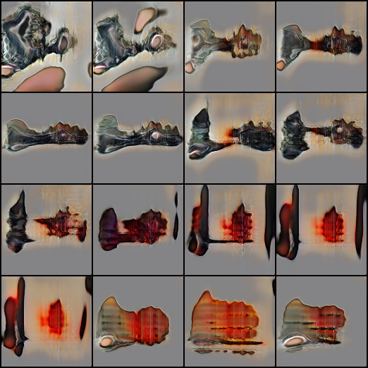
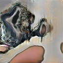
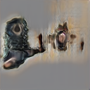
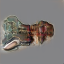
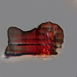
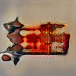
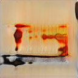
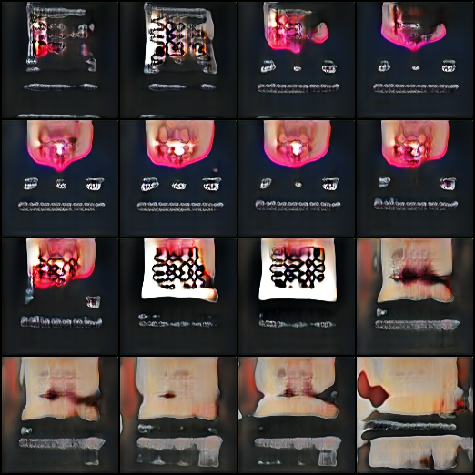
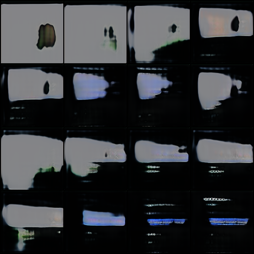

# latentspacewalker

*The Walker* - exploring the topology of generative latent space through random walks and gradient traversal.

---

## What is this?

A Progressive GAN trained entirely from scratch on a personal photograph archive.
No pretrained models. No external datasets. No CLIP. No Stable Diffusion.

The model learned to generate images by studying one person's visual world -
7,843 photographs accumulated over years of daily life.

Everything the model "knows" comes from this single source.

---

## Examples

### Random Walk Grid (16 frames)



*Seed 123: Organic forms morphing through latent space*

### Smooth Walk Sequence

A gradual transformation through the space, showing how forms evolve:

| Step 0 | Step 8 | Step 16 | Step 24 | Step 32 | Step 40 |
|--------|--------|---------|---------|---------|---------|
|  |  |  |  |  |  |

### More Walks

| Seed 42 | Seed 666 |
|---------|----------|
|  |  |

---

## The Core Idea

Deep generative models compress visual information into a **latent space** -
a high-dimensional mathematical manifold where each point corresponds to a possible image.

This project explores that space through **walking** - moving step by step
through the manifold and observing how images transform.

---

## Latent Space: A Primer

### What is it?

Imagine a room with 256 doors. Behind each combination of doors lies a unique image.
That's latent space - except instead of doors, we have continuous dimensions,
and instead of discrete combinations, we have smooth gradients.

A point in latent space is simply a list of 256 numbers:

```
z = [0.42, -1.23, 0.87, 0.01, ..., -0.56]
```

Feed this to the generator, get an image:

```
image = Generator(z)
```

### Why 256 dimensions?

This is a design choice. More dimensions = more expressive power, but harder to train.
256 is a sweet spot for this dataset size (~8000 images).

Each dimension captures some aspect of visual variation - though not in human-interpretable ways.
Dimension 47 doesn't mean "brightness" or "face angle". The meaning is distributed,
entangled, emergent.

### The Topology

Latent space is **continuous**. There are no gaps, no walls, no discrete categories.
Every point has infinitely many neighbors. Move a tiny bit in any direction,
get a slightly different image.

This continuity is what makes walking possible.

---

## Three Ways to Walk

### 1. Random Walk

```
z_next = z_current + random_direction * step_size
```

Each step: pick a random direction in 256D space, take a small step.

**Character:** Chaotic, exploratory, unpredictable. Like wandering a city without a map.

**Use case:** Discovering unexpected forms. Surveying the diversity of the space.

**Philosophical angle:** Non-teleological movement. No goal, no destination.
Forms emerge without intention. Creativity without creator.

### 2. Gradient Walk (Directional)

```
z_next = z_current + FIXED_direction * step_size
```

Pick ONE direction at the start. Follow it consistently.

**Character:** Systematic transformation along an axis. Like walking north until you hit the sea.

**Use case:** Understanding what a direction "means". Finding semantic axes.

**Philosophical angle:** Controlled experimentation. Hypothesis-driven exploration.

### 3. Interpolation

```
z = (1-t) * z_A + t * z_B,  where t goes from 0 to 1
```

The straight line between two known points.

**Character:** Morphing. Gradual transition from image A to image B.

**Use case:** Understanding the relationship between two points. Finding what lies "between".

**Philosophical angle:** Every pair of images has infinitely many intermediates.
The space between is as rich as the endpoints.

---

## Step Size: The Resolution of Movement

How far do we move with each step?

| Step Size | Effect |
|-----------|--------|
| 0.05 | Imperceptible change. Nearly identical frames. |
| 0.15 | Subtle gradient. Smooth morphing. Good for detailed study. |
| 0.30 | Visible transformation. Standard exploration. |
| 0.50 | Noticeable jumps. Faster traversal. |
| 1.00 | Large leaps. Risk of discontinuity. |
| 3.00 | Essentially random sampling. No coherent walk. |

The "right" step size depends on purpose:
- Animation? Use 0.05-0.15
- Exploration? Use 0.30
- Quick survey? Use 0.50+

---

## The Geography of This Latent Space

After generating hundreds of walks, patterns emerge. The space has regions:

### Document Territory
Horizontal lines. Text-like patterns. Light backgrounds with dark marks.
The model learned from photographs of papers, receipts, notes.

### Organic Zones
Centered forms. Soft gradients. Skin-like textures. Flowing curves.
Bodies, faces, organic matter.

### Glass Country
High contrast. Transparency. Reflections. Sharp edges meeting soft gradients.
Photographs of glass objects, windows, bottles.

### Atmospheric Regions
Silhouettes. Fog. Horizon lines. Gradual tonal shifts.
Outdoor photographs, skies, distances.

### Material Fields
Rust. Stone. Metal. Corrosion patterns. Surface textures.
Close-up photographs of objects, walls, grounds.

These aren't hard boundaries - they blend into each other.
A walk might start in organic territory and gradually drift into glass country.

---

## Technical Architecture

### Progressive GAN

Training starts at 4x4 resolution and progressively increases:

```
Level 0:  4x4
Level 1:  8x8
Level 2:  16x16
Level 3:  32x32
Level 4:  64x64
Level 5:  128x128  <- final resolution
```

This progressive approach has advantages:
- Learns coarse structure before fine detail
- More stable training
- Better results on limited data

### Generator

Takes 256-dimensional latent vector, outputs 128x128 RGB image.

Architecture: Series of transposed convolutions with learned upsampling.
Each level doubles spatial resolution while adjusting channel depth.

### Discriminator

Takes 128x128 image, outputs single scalar (real vs fake).

Architecture: Mirror of generator - convolutions that downsample progressively.

### Training

Adversarial training with WGAN-GP loss:
- Generator tries to fool discriminator
- Discriminator tries to distinguish real from generated
- Gradient penalty ensures stable training

Total training time: ~20 hours on consumer GPU (GTX 1660 Super).

---

## File Structure

```
latentspacewalker/
│
├── README.md                 <- You are here
│
├── walks/                    <- Grid images (16 frames per image)
│   ├── walk_seed42.png
│   ├── walk_seed123.png
│   └── ...
│
├── gradient_walks/           <- Step-by-step sequences
│   ├── walk_42/
│   │   ├── step_00.png
│   │   ├── step_01.png
│   │   └── ...
│   ├── smooth_walk_123/      <- Fine-grained (step_size=0.15)
│   └── ...
│
├── code/
│   ├── progressive_gan_smooth.py   <- Model architecture
│   ├── latent_explorer.py          <- Grid walk generator
│   └── stepwise_walker.py          <- Frame-by-frame generator
│
└── docs/
    ├── LATENT_SPACE_GUIDE.md       <- Detailed theory
    └── TRAINING_LOG.md             <- How the model was trained
```

---

## Usage

### Generate a grid walk (16 frames)

```bash
python code/latent_explorer.py --walk 123
```

### Generate step-by-step sequence

```bash
python code/stepwise_walker.py 123 --steps 32 --step_size 0.3
```

### Generate smooth sequence (fine gradient)

```bash
python code/stepwise_walker.py 123 --steps 48 --step_size 0.15
```

### Interpolate between two points

```bash
python code/latent_explorer.py --interpolate 42 666
```

Note: Requires trained model checkpoint (not included due to size).

---

## Philosophical Notes

### On Generative Space

The latent space is not a storage of images - it's a space of **potential**.
No image "exists" there until we choose a point and run the generator.
The space contains all possible images the model could produce,
but none of them are actual until actualized.

This is closer to a field of potential than a database.

### On Walking

To walk through latent space is to witness transformation without teleology.
There is no goal, no correct path, no destination.
Forms emerge, mutate, dissolve, recombine.

Random walking surrenders control to chance.
We become observers of a process we initiated but do not direct.

### On Training Data

The model knows only what it has seen: 7,843 photographs from one life.
Every generated image is a recombination of that visual vocabulary.

The outputs are neither copies nor inventions - they are **variations**.
New configurations of learned patterns. Familiar elements in unfamiliar arrangements.

### On Authorship

Who creates these images?

- The person who took the original photographs?
- The architecture that processes them?
- The random seed that selects the starting point?
- The step size that determines the trajectory?

Perhaps the question is malformed.
Perhaps creation is distributed across all these factors.
Perhaps the images create themselves, given the conditions.

---

## The From-Scratch Principle

This model uses no pretrained components:
- No ImageNet weights
- No CLIP embeddings
- No Stable Diffusion
- No external knowledge

Everything was learned from the source photographs.

This is intentional. The goal is a model that knows only one visual world -
not the aggregate of the internet, but the specific, limited, personal.

The constraints are the point.

---

## Sample Walks

### walk_seed123 (Organic)
Centered forms that flow and morph. Skin tones, soft gradients.
One of the most "sculptural" regions found.

### walk_seed666 (Minimal)
High contrast. Dark backgrounds with isolated bright forms.
Dramatic, almost theatrical.

### walk_seed333 (Fossil)
Stone-like textures. Relief patterns. Ancient feeling.

### walk_seed777 (Atmospheric)
Horizons, silhouettes, mist. Landscape sensibility.

---

## License

Images and samples are original outputs from a personally trained model.

Code is provided for educational purposes.

The model was trained on personal photographs and produces derivative variations
based on that specific visual vocabulary.

---

## Documentation

- **[HISTORY.md](HISTORY.md)** - Complete journey: 400 hours, 46 experiments, what failed and why
- **[REPRODUCE.md](REPRODUCE.md)** - Step-by-step guide to recreate everything from scratch
- **[docs/LATENT_SPACE_GUIDE.md](docs/LATENT_SPACE_GUIDE.md)** - Deep dive into latent space mathematics

---

*latentspacewalker - 2026*
